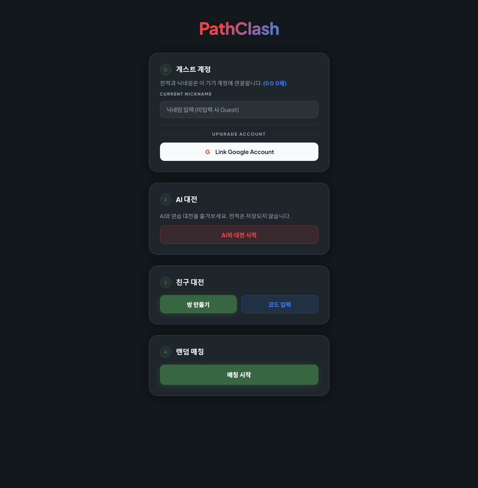
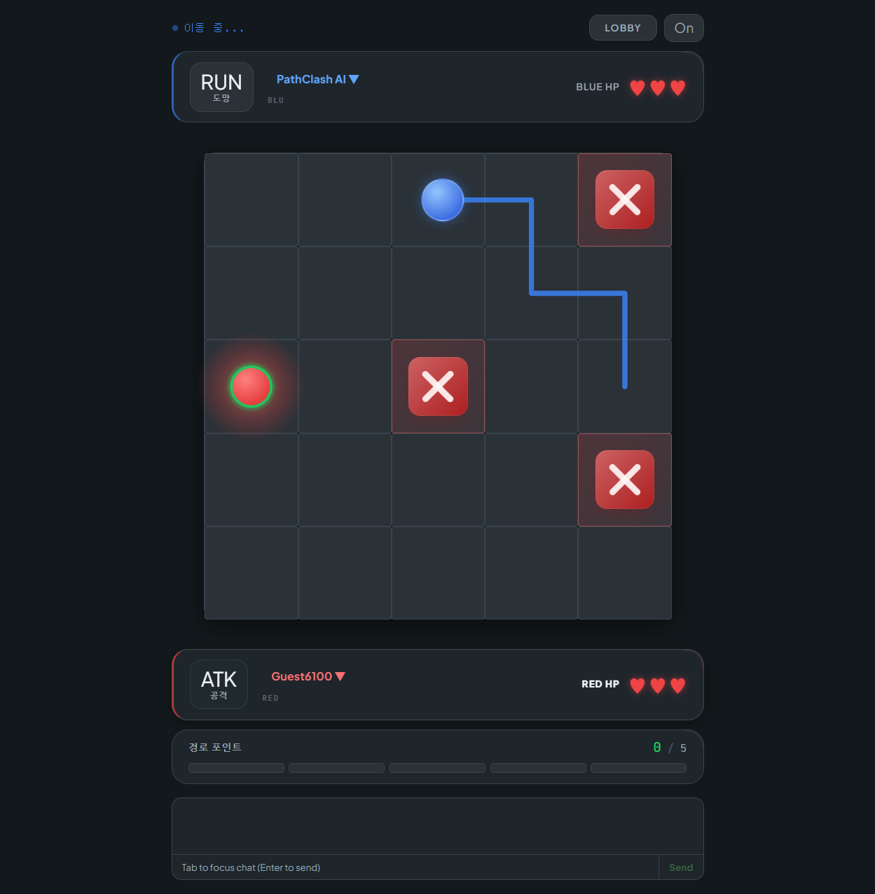

# PathClash

> **Plan your path. Predict their move. Win.**

A real-time 1v1 strategy game played on a 5×5 grid. Every turn, you have 10 seconds to draw a path — then both paths execute simultaneously. One player hunts. The other flees. Roles swap each round.

🎮 **[Play now at pathclash.com](https://pathclash.com)**

---

## Screenshots

| Lobby | In-Game |
|---|---|
|  |  |

---

## How It Works

```
┌───┬───┬───┬───┬───┐
│   │   │   │   │   │
├───┼───┼───┼───┼───┤
│   │   │   │   │   │
├───┼───┼───┼───┼───┤
│ R │   │   │   │ B │  ← Starting positions
├───┼───┼───┼───┼───┤
│   │   │   │   │   │
├───┼───┼───┼───┼───┤
│   │   │   │   │   │
└───┴───┴───┴───┴───┘
```

**Each turn:**
1. Both players secretly draw their path (up to 10 steps, no diagonals)
2. When time runs out, both paths execute at once — animated, step by step
3. If the **attacker** intercepts the **escaper**, the escaper loses 1 HP
4. Roles flip next round

**Win** by reducing your opponent to 0 HP (3 HP each to start).

---

## Features

- **Simultaneous reveal** — paths execute in sync; no information advantage
- **Escalating stakes** — path length grows each turn, up to a 10-step maximum
- **Attacker/Escaper roles** — chase or evade, then switch
- **Collision effects** — impact animations, screen shake, hit sounds
- **Real-time chat** — Tab to focus the chat box; keyboard-only play fully supported
- **Three ways to play** — vs. AI · private match with a friend code · random matchmaking
- **Guest auth** — no account needed; jump in immediately
- **Rematch** — challenge the same opponent again after a match ends
- **Player stats** — click your opponent's name to see their win record
- **Responsive layout** — works on desktop, tablet, and mobile

---

## Tech Stack

| Layer | Technology |
|---|---|
| Frontend | React 19, TypeScript, Vite |
| State | Zustand |
| Realtime | Socket.io |
| Backend | Node.js, Express 5, TypeScript |
| Database | Supabase (PostgreSQL) |
| Audio | Howler.js |
| Deployment | Render (server) · pathclash.com (client) |

---

## Run Locally

**Prerequisites:** Node.js 18+

```bash
# 1. Clone
git clone https://github.com/your-username/PathClash.git
cd PathClash

# 2. Server
cd server
cp .env.example .env   # fill in SUPABASE_URL and SUPABASE_ANON_KEY
npm install
npm run dev

# 3. Client (new terminal)
cd client
cp .env.example .env   # set VITE_SERVER_URL=http://localhost:3001
npm install
npm run dev
```

Open [http://localhost:5173](http://localhost:5173).

---

## Project Structure

```
PathClash/
├── client/          # React frontend
│   └── src/
│       ├── components/
│       │   ├── Game/    # Grid, pieces, timer, chat, HP display
│       │   └── Lobby/   # Matchmaking, friend code, AI mode
│       ├── store/       # Zustand game state
│       └── socket/      # Socket.io event handlers
└── server/          # Node.js backend
    └── src/
        └── socket/  # Room management, game logic, turn resolution
```

---

## License

MIT
